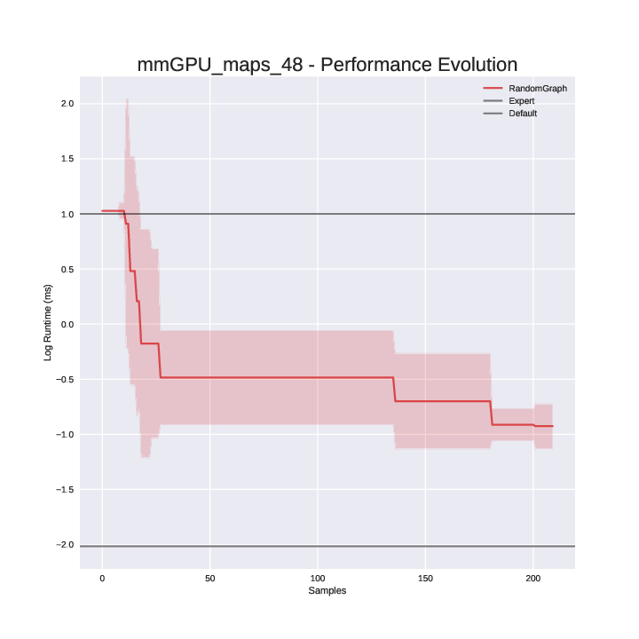

# exploration_plotting

Plotting scripts to visualize exploration of rewrites with integrated parameter tuning

## Performance Evolution



## Get Started

```
python3 exploration_plotting.py -p performance_evolution -i example/mm -n mm -o . --expert 0.01 --default 10 --log 
```

